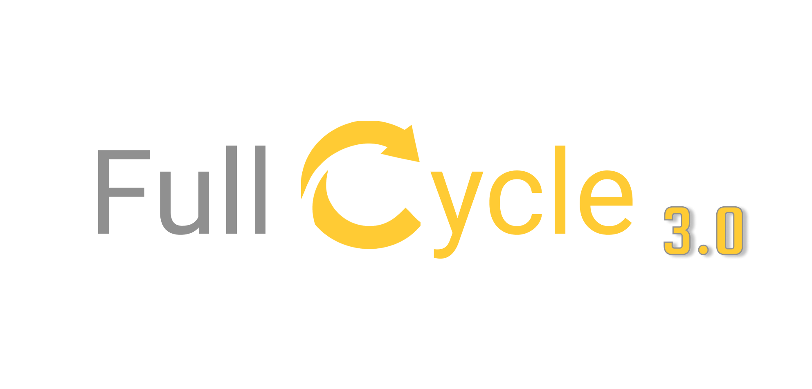

 

<h4  align="center">
	💅 Maratona Full Cycle 
</h4>

<a  href="#telescope-projeto">🔭 Projeto</a>&nbsp;&nbsp;&nbsp;|&nbsp;&nbsp;&nbsp
<a  href="#fire-desafios">💜 Desafios</a>&nbsp;&nbsp;&nbsp;

## :telescope: Projeto

A **Maratona Full Cycle 3.0** foi um evento online realizado pela instituição [Full Cycle](https://fullcycle.com.br/), foi demonstrados vários conceitos sobre arquitetura de microsserviços e apresentados pontos importantes para a utilização de docker para agilizar e facilitar o ambiente de desenvolvimento e produção.

# :fire: Desafios 

### [:cyclone: Desafio GoLang](https://github.com/Luuck4s/Full-Cycle/tree/master/challenger_1)

### [:water_buffalo: Desafio Buffalo](https://github.com/Luuck4s/Full-Cycle/tree/master/challenger_2)

### [:zap: Desafio Serverless](https://github.com/Luuck4s/Full-Cycle/tree/master/challenger_3)

### [:snake: Desafio Django e SQLite](https://github.com/Luuck4s/Full-Cycle/tree/master/challenger_4)

--- 

<h5 align="center"> 🚀 Maratona FullCycle  by Luuck4s 💜 </h5>

---

