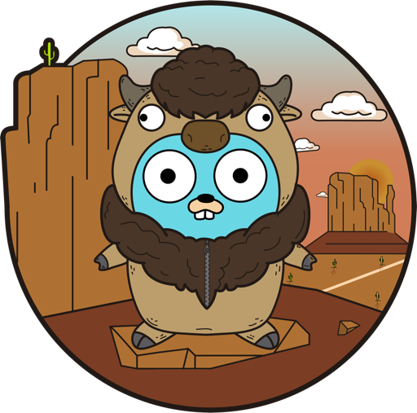

 

## :water_buffalo: Desafio Buffalo

Esse desafio consiste em criar uma página web com o conteúdo `Hello Full Cycle` utilizando a linguagem Golang e o framework Buffalo.  
Quando o usuário acessar o projeto no endpoint `/hello`, ele deverá ver a mensagem `Hello Full Cycle`.  
Para fazer a entrega do desafio, gere uma imagem docker de sua aplicação funcionando e a disponibilize em sua conta no Docker Hub.  
  
Quando alguém executar: **docker run -p 3000:3000 seuuser/suaimagem**, a aplicação deverá estar disponível na porta 3000.

## 🤠 Getting Started

Execute dentro da pasta do projeto `$ buffalo dev` ou utilize através do docker executando `$ docker pull luuck4s/fullcycle-desafio-buffalo`, e em seguida `$ docker run -p 3000:3000 luuck4s/fullcycle-desafio-buffalo`

